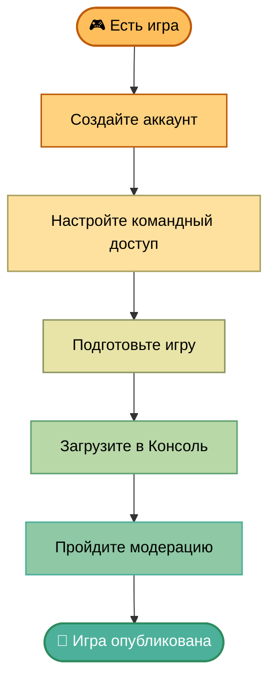

---
metadata:
  - name: generator
    content: Diplodoc Platform v5.52.0
alternate:
  - https://yandex.ru/dev/games/doc/en/concepts/quick-start.md
  - https://yandex.ru/dev/games/doc/hi/concepts/quick-start.md
  - https://yandex.ru/dev/games/doc/ko/concepts/quick-start.md
  - https://yandex.ru/dev/games/doc/ru/concepts/quick-start.md
  - https://yandex.ru/dev/games/doc/tr/concepts/quick-start.md
  - https://yandex.ru/dev/games/doc/vi/concepts/quick-start.md
  - https://yandex.ru/dev/games/doc/zh/concepts/quick-start.md
  - href: ru/concepts/quick-start.md
    type: text/markdown
    title: Markdown version
  - href: ../llms.txt
    type: text/markdown
    title: llms.txt
---
> **Documentation Index:** Fetch the complete configuration index at https://yandex.ru/dev/games/doc/ru/llms.txt

# Быстрый старт

<!-- source: ru/_includes/script-common.md -->
<!-- source: ru/_includes/script/index-js.md -->

<!-- endsource: ru/_includes/script/index-js.md -->

<!-- source: ru/_includes/script/requirements-js.md -->

<!-- endsource: ru/_includes/script/requirements-js.md -->

<!-- source: ru/_includes/script/image-modal-js.md -->

<!-- endsource: ru/_includes/script/image-modal-js.md -->

<!-- source: ru/_includes/script/neuroexpert-widget.md -->

<!-- endsource: ru/_includes/script/neuroexpert-widget.md -->
<!-- endsource: ru/_includes/script-common.md -->

[Яндекс Игры](https://yandex.ru/games/){.external} — бесплатная платформа для публикации браузерных игр. Вы подключаете SDK, загружаете игру — и она становится доступна миллионам игроков без установки. Мы берем на себя хостинг, авторизацию и монетизацию — вам остается сосредоточиться на игре и ее росте.

Выполните шаги ниже и разместите готовую игру на платформе:

```mermaid
flowchart LR
    Game(["🎮 Есть игра"]) --> S1["Создайте<br/>аккаунт"]
    S1 --> S2["Настройте<br/>командный<br/>доступ"]
    S2 --> S3["Подготовьте<br/>игру"]
    S3 --> S4["Загрузите<br/>в Консоль"]
    S4 --> S5["Пройдите<br/>модерацию"]
    S5 --> Done(["🚀 Игра<br/>опубликована"])

    click S1 "ru/concepts/quick-start#registration" "Перейти к шагу 1"
    click S2 "ru/concepts/quick-start#team-access" "Перейти к шагу 2"
    click S3 "ru/concepts/quick-start#requirements-sdk" "Перейти к шагу 3"
    click S4 "ru/concepts/quick-start#draft" "Перейти к шагу 4"
    click S5 "ru/concepts/quick-start#moderation" "Перейти к шагу 5"
    click Done "ru/concepts/quick-start#after-publication" "После публикации"

    classDef start fill:#ffbe5c,stroke:#bd5c0a,stroke-width:2px,color:#000;
    classDef step1 fill:#ffd27f,stroke:#bd5c0a,stroke-width:1.5px,color:#000;
    classDef step2 fill:#ffe19f,stroke:#a8a060,stroke-width:1.5px,color:#000;
    classDef step3 fill:#e8e4a8,stroke:#8a9560,stroke-width:1.5px,color:#000;
    classDef step4 fill:#b8d8a8,stroke:#5fa070,stroke-width:1.5px,color:#000;
    classDef step5 fill:#8ec8a4,stroke:#4db09b,stroke-width:1.5px,color:#000;
    classDef finish fill:#4db09b,stroke:#2d8b5d,stroke-width:2px,color:#fff;

    class Game start;
    class S1 step1;
    class S2 step2;
    class S3 step3;
    class S4 step4;
    class S5 step5;
    class Done finish;
```



Сразу переходите к [заполнению черновика](https://yandex.ru/dev/games/doc/ru/console/add-new-game.md#step-create-and-fill-draft).



## Шаг 1. Зарегистрируйтесь {#registration}

### В Консоли {#console}

[Консоль разработчика](https://games.yandex.ru/console){.external} — личный кабинет, где вы управляете играми: загружаете билды, настраиваете монетизацию и продвижение, следите за метриками. Чтобы получить к ней доступ:

1. [Создайте аккаунт разработчика](https://yandex.ru/dev/games/doc/ru/console/manage-account.md). При регистрации используйте Яндекс ID с логином Яндекса.
1. В разделе **Профиль** укажите [Предпочитаемый язык для связи](https://yandex.ru/dev/games/doc/ru/console/manage-account.md#profile-manage). На этом языке мы будем с вами общаться.

### В РСЯ {#partner}

Рекламная сеть Яндекса нужна для [подключения монетизации](https://yandex.ru/dev/games/doc/ru/console/adv-monetization.md#enable-int-monetization) и получения выплат за рекламу и инап-покупки:

1. Создайте аккаунт в [РСЯ](https://partner.yandex.ru/){.external} и примите условия соглашения. Если вы — физическое лицо, зарегистрируйтесь как самозанятый или ИП.
1. Укажите [реквизиты для выплат](https://partner.yandex.ru/v2/settings/financial/){.external} и актуальные контакты.

## Шаг 2. Настройте командный доступ {#team-access}

Если вы работаете в команде, в разделе [Пользователи и доступ](https://games.yandex.ru/console/linked-accounts){.external} настройте [роли и доступы](https://yandex.ru/dev/games/doc/ru/console/teamwork.md). Другой участник сможет загрузить игру вместо вас.

## Шаг 3. Подготовьте архив с игрой {#requirements-sdk}

### Ознакомьтесь с требованиями {#requirements}

Изучите [требования](https://yandex.ru/dev/games/doc/ru/concepts/requirements.md) к игре и промоматериалам — это сэкономит время на модерации.

### Подключите SDK или плагин {#sdk}

SDK открывает доступ к возможностям платформы: помогает добавить рекламу и покупки, сохранять прогресс игрока на сервере Яндекса, менять поведение игры без обновления билда. Без SDK игру опубликовать не получится.

Вы можете подключить SDK:

- [напрямую](https://yandex.ru/dev/games/doc/ru/sdk/sdk-about.md) через код игры;
- с помощью [плагинов](https://yandex.ru/dev/games/doc/ru/sdk.md#official-plugins) для популярных движков.

## Шаг 4. Загрузите игру в Консоль {#draft}

В Консоли разработчика [добавьте игру](https://yandex.ru/dev/games/doc/ru/console/add-new-game.md) и на вкладке **Черновик**:

- загрузите архив с файлами игры на сервер Яндекса;
- укажите, на какие языки локализована игра ([рекомендуемые языки](https://yandex.ru/dev/games/doc/ru/concepts/languages-and-domains.md#languages));
- добавьте описания и промоматериалы.

Подробнее о полях черновика см. на странице [Заполнение черновика](https://yandex.ru/dev/games/doc/ru/console/add-new-game/draft.md).

Если в игре есть [инап-покупки](https://yandex.ru/dev/games/doc/ru/console/purchases.md), заранее напишите на [games-partners@yandex-team.ru](mailto:games-partners@yandex-team.ru){.external}: укажите название и ID игры.

## Шаг 5. Пройдите модерацию {#moderation}

### Протестируйте игру {#test}

Перед отправкой на проверку [протестируйте игру](https://yandex.ru/dev/games/doc/ru/console/test-game.md) самостоятельно.

<!-- source: ru/_includes/requirements/violated-requirements.md -->


#|
|| **Пункт Требований к игре** | **Категория** | **Нарушение** | **Пояснение** ||
|| [1.6.1.8](https://yandex.ru/dev/games/doc/ru/concepts/requirements.md#1-6-1-8), [1.6.2.7](https://yandex.ru/dev/games/doc/ru/concepts/requirements.md#1-6-2-7) | UI / Интерфейс | Контекстное меню при взаимодействии | При правом клике или долгом нажатии появляется системное контекстное меню браузера — его необходимо отключить в игровой области. ||
|| [1.6.1.6](https://yandex.ru/dev/games/doc/ru/concepts/requirements.md#1-6-1-6), [1.6.2.5](https://yandex.ru/dev/games/doc/ru/concepts/requirements.md#1-6-2-5) | ^ | Системный плеер (десктоп и мобильные устройства) | Видеоконтент воспроизводится через системный плеер вместо встроенного игрового — нарушает целостность интерфейса. [Подробнее](https://yandex.ru/dev/games/doc/ru/requirements/1/6.md). ||
|| [4.7](https://yandex.ru/dev/games/doc/ru/concepts/requirements.md#4-7) | ^ | Звук при показе рекламы не ставится на паузу | Во время показа рекламного ролика звук из игры продолжает играть. Необходимо ставить аудио на паузу на время рекламы. ||
|| [1.3](https://yandex.ru/dev/games/doc/ru/concepts/requirements.md#1-3) | ^ | Звук продолжается при переключении вкладки | Музыка или звуки из игры не останавливаются при уходе со вкладки. Необходимо реагировать на потерю фокуса страницы. [Подробнее](https://yandex.ru/dev/games/doc/ru/requirements/1/3.md). ||
|| [1.19.2](https://yandex.ru/dev/games/doc/ru/concepts/requirements.md#1-19-2) | SDK / Game Ready | Game Ready работает некорректно | Game Ready подключен, но метод `ysdk.features.LoadingAPI.ready()` вызывается неправильно или в неверный момент жизненного цикла игры. [Подробнее](https://yandex.ru/dev/games/doc/ru/requirements/1/19.md#gameready). ||
|| [2.14](https://yandex.ru/dev/games/doc/ru/concepts/requirements.md#2-14) | ^ | Автоопределение языка через SDK не реализовано | Язык интерфейса задается вручную вместо использования `ysdk.environment.i18n.lang`. Игра должна автоматически подстраиваться под язык пользователя. [Подробнее](https://yandex.ru/dev/games/doc/ru/requirements/2/14.md). ||
|| [1.19.2](https://yandex.ru/dev/games/doc/ru/concepts/requirements.md#1-19-2) | ^ | Game Ready не используется совсем | Game Ready не интегрирован, хотя обязателен для публикации в каталоге. [Подробнее](https://yandex.ru/dev/games/doc/ru/requirements/1/19.md#gameready). ||
|| [1.1](https://yandex.ru/dev/games/doc/ru/concepts/requirements.md#1-1) | ^ | SDK не встроен или встроен некорректно | Скрипт SDK отсутствует, подключен не из официального источника или инициализируется с ошибками. [Подробнее](https://yandex.ru/dev/games/doc/ru/sdk/sdk-about.md#check). ||
|| [1.9](https://yandex.ru/dev/games/doc/ru/concepts/requirements.md#1-9) | Технические сбои | Прогресс не сохраняется | Результаты, уровни или настройки не сохраняются между сессиями. Необходимо использовать объект `Player` для хранения данных. [Подробнее](https://yandex.ru/dev/games/doc/ru/requirements/1/9.md). ||
|| [1.14](https://yandex.ru/dev/games/doc/ru/concepts/requirements.md#1-14) | ^ | Игра не запускается | Загрузочный экран зависает или игра не доходит до геймплея. Проверьте консоль на ошибки при инициализации. [Подробнее](https://yandex.ru/dev/games/doc/ru/requirements/1/14.md). ||
|| [1.14](https://yandex.ru/dev/games/doc/ru/concepts/requirements.md#1-14) | ^ | Ошибка на старте или при действиях | В консоли браузера появляются JS-ошибки при запуске или в ходе игры, которые влияют на работоспособность. [Подробнее](https://yandex.ru/dev/games/doc/ru/requirements/1/14.md). ||
|| [1.15](https://yandex.ru/dev/games/doc/ru/concepts/requirements.md#1-15) | ^ | Игра зависает или тормозит | Заметные фризы или падение производительности делают игру некомфортной для пользователя. [Подробнее](https://yandex.ru/dev/games/doc/ru/requirements/1/15.md). ||
|| [2.3](https://yandex.ru/dev/games/doc/ru/concepts/requirements.md#2-3) | Соответствие описанию | Игра не соответствует заявленному жанру | Геймплей противоречит выбранной на вкладке **Черновик** [категории](https://yandex.ru/dev/games/doc/ru/console/add-new-game/draft.md#field-category). Жанр и описание должны точно отражать содержание игры. ||
|#


<!-- endsource: ru/_includes/requirements/violated-requirements.md -->

### Отправьте на модерацию {#submit}

На вкладке **Черновик** нажмите **Отправить на модерацию** — игра перейдет в статус **Ожидает модерации**. Если хотите сами выбрать время релиза, заранее включите опцию [Отсроченная публикация](https://yandex.ru/dev/games/doc/ru/console/add-new-game/draft.md#field-delay).

<!-- source: ru/_includes/console/moderation.md -->
Игру проверят на соответствие [требованиям](https://yandex.ru/dev/games/doc/ru/concepts/requirements.md). Обычно [модерация](https://yandex.ru/dev/games/doc/ru/concepts/moderation.md) занимает 3−5 рабочих дней.
<!-- endsource: ru/_includes/console/moderation.md -->



Результаты проверки вы увидите в [Консоли](https://games.yandex.ru/console){.external}:

- Если модерация одобрит игру, статус изменится на:

  - **Опубликовано**: игра опубликуется автоматически.
  - **Проверен**, если включена опция **Отсроченная публикация**. На вкладке **Черновик** появится кнопка **Опубликовать**.

- Если в публикации откажут, статус изменится на **Отклонен**. Причины придут на почту, указанную в [аккаунте разработчика](https://yandex.ru/dev/games/doc/ru/console/manage-account.md#profile-manage).



## После публикации {#after-publication}

- Неделю игра будет в разделе [Новые](https://yandex.ru/dev/games/doc/ru/concepts/ranking-and-featuring.md#new-category) и ML-алгоритмы определят для нее подходящую аудиторию.
- Через две недели на карточке появится [рейтинг](https://yandex.ru/dev/games/doc/ru/concepts/metric.md#product) вовлечения и удержания игроков.

Дальше — [оперирование](https://yandex.ru/dev/games/doc/ru/liveops.md): метрики, A/B-тесты и работа с аудиторией.
